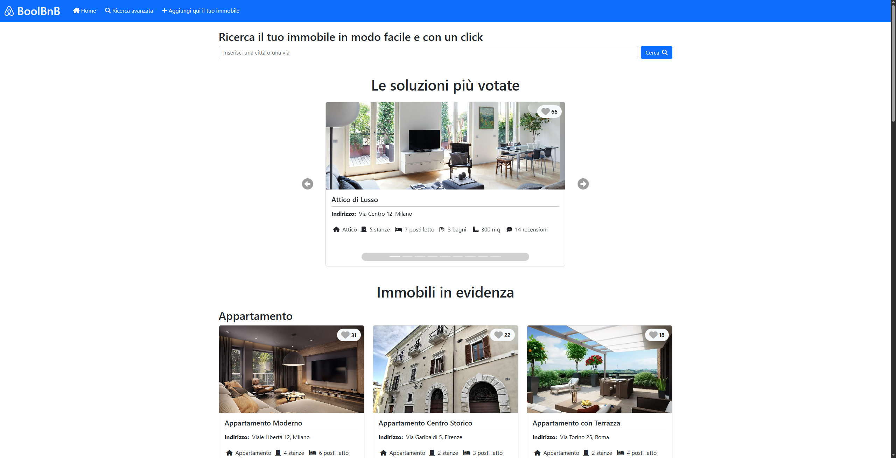
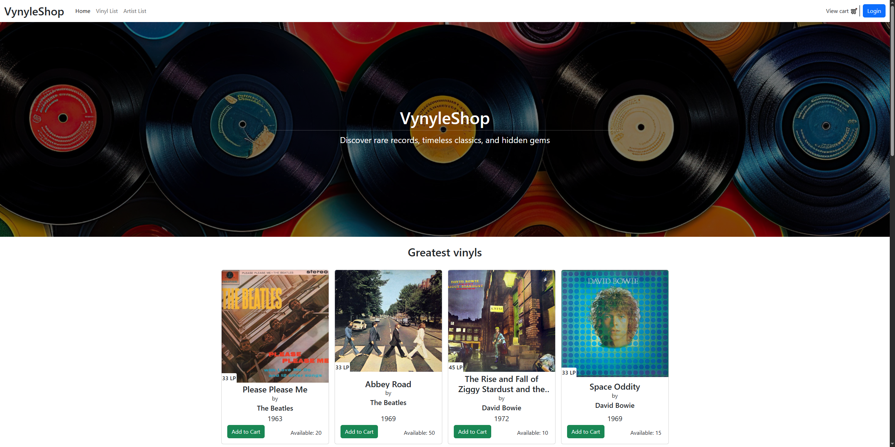

# 👋 Ciao, sono Simone

💻 Sviluppatore **Fullstack** con una passione per l’automazione  
🛠️ Lavoro principalmente con **Spring** e **React**  
🚀 Creo/contribuisco a progetti open source  
💡 Mi piace costruire soluzioni semplici a problemi complessi e condividere ciò che imparo

## 🌐 Socials  
 

## 💻 Tech Stack

### 👨‍💻 Linguaggi & Framework  

### 🧰 Altri linguaggi & tool

### 🗄️ Database & backend tools  

### ⚙️ Dev Tools  

## 📊 Progetti in Evidenza

| 🏢 **[BoolBnB - ReactJs](https://github.com/carlo191/BoolB-B-Front-End.git)** | 💿 **[VynyleShop - ReactJs](https://github.com/SimoneChiodo/frontend-vynyleshop-vite.git)** |
| :---: | :---: |
|    Sito per la _**ricerca di immobili in affitto**_ sviluppato con _**ReactJs**_ e _**Bootstrap**_.   <a href="https://github.com/carlo191/BoolB-B-Back-End.git">**Link** al **Backend** sviluppato con **Express**</a> |    Sito per la _**vendita di vinili**_ sviluppato con _**ReactJs**_ e _**Bootstrap**_.   <a href="https://github.com/SimoneChiodo/backend-vynyleshop-spring.git">**Link** al **Backend** sviluppato con **Spring**</a> |

## 📊 GitHub Stats

  
  

